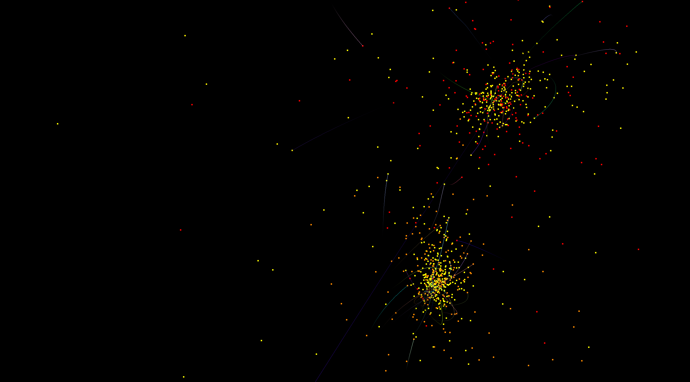

# GalaXeirb - Collision intergalactique CUDA


## Présentation
Ce projet a pour but de nous familiariser avec l'utilisation de la technologie CUDA. Le principe consiste à simuler une collision entre deux galaxies. Chacune d'elles est composée d'entité avec une masse, une vélocité et une position. Calculer les interactions entre-elles nécessite une puissance de calcul plus importante qu'un simple CPU car la complexité augmente au carré en fonction du nombre d'entité.

## Auteurs
Ce projet a été réaliser dans le cadre d'un projet de l'ENSEIRB-MATMECA. Nous sommes deux étudiants de la fillière par apprentissage SEE 2A.
* David DEVANT
* Aurélien TROMPAT

## Installation
Un makefile a été crée pour pouvoir compiler sur les cartes embarqués CUDA. Pour compiler sur CPU, nous avons utilisé l'IDE Eclipse, il n'y a donc pas de recette make pour CPU. Toutefois, il est possible d'ouvrir le projet avec Eclipse.
Pour compiler le projet, il suffit d'exécuter la commande suivante

```sh
$ make all
```

### Les options de compilation
```sh
-D CUDA_ENABLE
```
Permet d'activer la partie CUDA lors de la compilation
```sh
-D THREAD_ENABLE
```
Permet d'activer le calcul des interactions sur plusieurs threads (Voir NB_THREAD pour le nombre de thread)
```sh
-D STAR_WARS_ENABLE
```
Active le mode Star Wars (Crée un Tie Fighter plutôt que des galaxies)
```sh
-D DEBUG
```
Mode debug, ne devrait pas être utilisé

### Lancement
Pour lancer l'application, exécutez le fichier suivant : ./bin/Galaxeirb_cu
Un fichier LOG est créé (galaxeirb.log), il indiquera les éventuelles erreurs

## Fichier Dubinski
Les informations concernant les entités (Masse, position, vélocité) sont stockées dans les fichiers ./ressources/dubinskiX.tab où X est un chiffre qui indique le nombre d'entité contenues dans le fichier.

| Indicateur | NB entités |
| --------- | --- |
| 1 | 81920 |
| 2 | 1025 |
| 3 | 962 |
| 4 | 10241 |
| 5 | 5121 |
| 6 | 3 |
| 7 | 128 |


## Les commandes
L'interface utilisateur est dotée de plusieurs commande qui permettent d'interagir avec le programme, voici la liste :
* F1 : Affiche/cache le repère
* F2 : Affiche/cache la grille
* F3 : Affiche/cache les entités
* F4 : Cache la grille et le repère puis ajuste la caméra au centre du monde
* F6 : Fige/démarre la collision intergalactique
* F7 : Affiche/cache les historiques des entités
* F12 : Mode de contrôle camera Star Wars (Libère les contrainte caméra et autorise les lancés de blaster)
* D/Q/Z/S : Déplacement horizontal de la caméra
* N/B : Déplacement vertical de la caméra
* A : Passe la caméra en orbite 
* ESC : Quitte l'application

## Les performances
### Sur CPU (MacBook Pro 2015 à 2,7GHz)
| Nb Thread | FPS |
| --------- | --- |
| 1 | 100 |
| 4 | 150 |

Résultats surprenant dans ce second cas, on s'attend à avoir un ratio proche de x4.
Nous supposons qu'il manque une définition des affinités CPU pour exécuter les threads sur 4 coeurs

### Sur CUDA (Tegra K1)
| Nb Bloc | Nb Thread | FPS |
| ------- | --------- | --- |
| 1 | 1024 | 500 |
| 192 | 6 | 80 |

Nous supposons que tous les blocs demandent des accès mémoires qui ralentissent le système.

## Todos
* Utiliser la mémoire partagée (100x plus rapide que la mémoire globale)
* Exécuter make_a_move() sur tous les blocs disponibles
* Utiliser la mémoire constante pour les masses
* Approfondir les recherches sur l'utilisation des accès mémoire "Single Read"

## Photos


